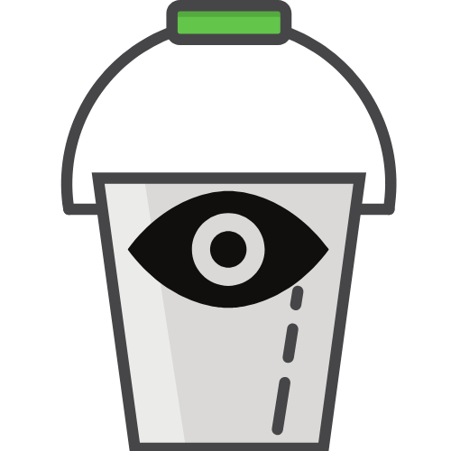
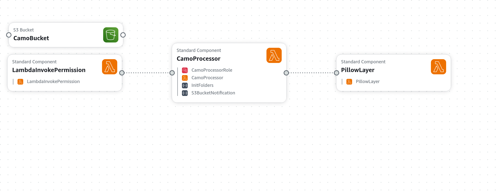

# CamoBucket
[](https://github.com/kevinl95/CamoBucket/actions/workflows/main.yml)

**Protect your privacy from facial recognition systems and geolocation** - automatically strip metadata and add imperceptible noise to your photos that confuses AI while keeping them looking normal to humans.

## Why CamoBucket?

### Privacy Protection
- **Facial recognition is everywhere** - from social media auto-tagging to surveillance systems in stores, airports, and public spaces
- **Your photos leak sensitive data** - EXIF metadata reveals your location, camera model, and when photos were taken
- **CamoBucket fights back** by reducing how recognizable your photos are to AI systems and stripping all metadata while preserving visual quality

### On-the-Go Protection
- **Deploy once, use anywhere** - upload photos from your phone to your AWS S3 bucket while traveling, at events, or in daily life
- **No apps to install** - works with any device that can upload to S3 (phones, tablets, cameras with WiFi)
- **Process in seconds** - your cloaked photos are ready almost instantly
- **Your own infrastructure** - complete control over your data, no third-party services handling your personal photos

## Quick Deploy

[](https://console.aws.amazon.com/cloudformation/home?region=us-east-1#/stacks/new?stackName=CamoBucket&templateURL=https://camobucket.s3.us-east-1.amazonaws.com/cloudformation.yml)

## Manual Deployment Steps

1. **Deploy via AWS Console** or CLI:
   ```bash
   aws cloudformation create-stack \
     --stack-name CamoBucket \
     --template-url https://camobucket.s3.amazonaws.com/cloudformation.yml \
     --parameters ParameterKey=BucketName,ParameterValue=my-camo-bucket \
     --capabilities CAPABILITY_IAM
   ```

where the BucketName is the bucket where your input/output directories for your photos will go.

## How It Works

CamoBucket uses adversarial noise to protect privacy by confusing facial recognition systems while keeping images visually normal to humans.

### The Lambda Function
- **Triggers automatically** when images are uploaded to the `input/` folder
- **Adds targeted noise** using Gaussian perturbations focused on face-likely regions (upper 60% of image)
- **Strips all metadata** - removes EXIF data including GPS location, timestamps, and camera information
- **Preserves image quality** by using minimal noise intensity and high JPEG quality (95%)
- **Outputs cloaked images** to the `output/` folder with "cloaked_" prefix

### Adversarial Noise Technique
- **Gaussian noise** is added with higher intensity in the upper portion of images where faces typically appear
- **Imperceptible to humans** but causes neural networks to misclassify or fail to detect faces
- **Transferable across models** - noise that fools one facial recognition system often works on others
- **Lightweight approach** that doesn't require training or face detection, making it fast and scalable



## Usage

1. Upload images to the `input/` folder
2. Processed images appear in `output/` with adversarial noise added
3. The noise is designed to confuse facial recognition while remaining visually subtle